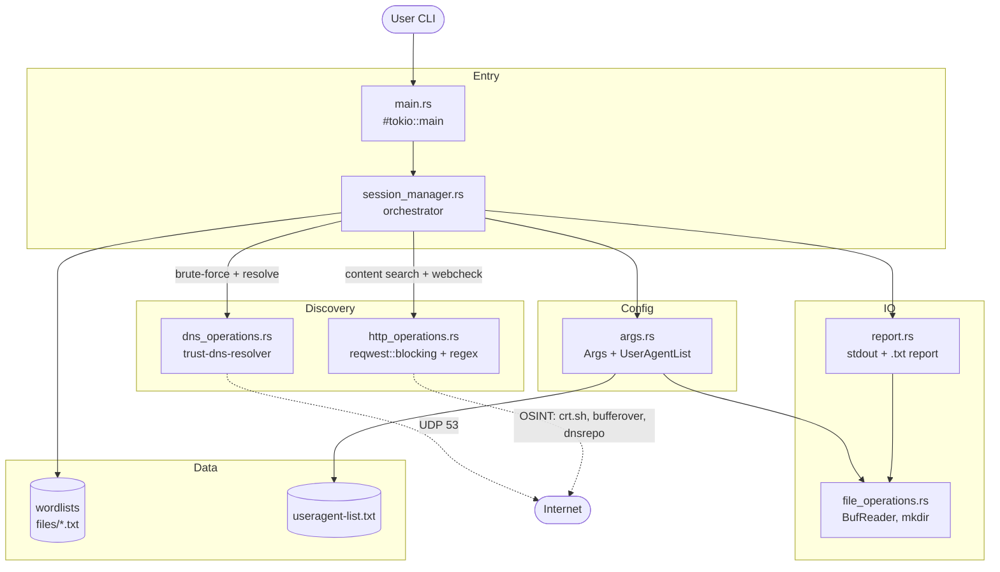
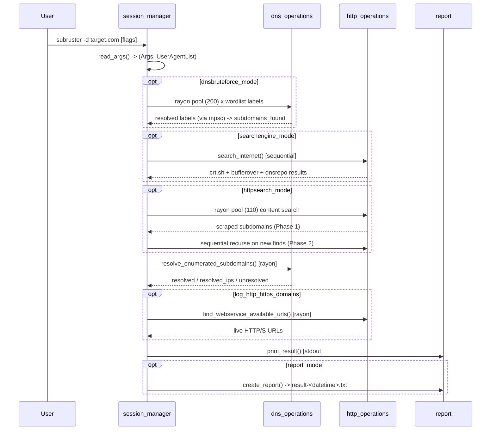

# Codebase Map

> Auto-generated by Cartographer. Last mapped: 2026-05-30

Subruster is a fast, compact subdomain enumeration / reconnaissance CLI written in Rust. It combines three discovery strategies — DNS brute-force, passive OSINT search, and recursive HTTP content scraping — into one pipeline, then resolves findings and writes a timestamped report.

## System Overview



## Directory Structure

```
Subruster/
├── src/
│   ├── main.rs              Binary entry point (#[tokio::main] -> session_manager)
│   ├── lib.rs               Crate root; re-exports all modules with #[path]
│   ├── args.rs              CLI parsing, Args config struct, UserAgentList
│   ├── session_manager.rs   Scan lifecycle orchestrator + Session state
│   ├── dns_operations.rs    Async DNS A-record resolution (trust-dns-resolver)
│   ├── http_operations.rs   HTTP/HTTPS fetch, subdomain regex, OSINT, webcheck
│   ├── file_operations.rs   Custom BufReader wrapper + create_directory
│   └── report.rs            stdout colored output + timestamped .txt report
├── tests/
│   ├── test_args.rs             UserAgentList::read_useragents happy path
│   ├── test_dns_operations.rs   live lookup of halborn.com (brittle, hardcoded IP)
│   └── test_http_operations.rs  live HTTP/HTTPS GET to google.com
├── files/                   Wordlists + user-agent pool (see Data Assets)
├── Cargo.toml               Manifest (edition 2021, subruster v0.1.0)
├── README.md                Tool description + CLI flags
└── CLAUDE.md                LLM coding-discipline guidelines (not tool docs)
```

## Module Guide

### main.rs

**Purpose**: Binary entry point — initializes the async runtime, delegates to the orchestrator.
**Entry point**: `async fn main()` decorated `#[tokio::main]`.
**Body**: single call `session_manager::start_session_operations().await`.
**Dependencies**: `subruster::session_manager`.
**Gotcha**: Uses **tokio 0.2.18** (pre-1.0) at the top level, pinned by `trust-dns-resolver 0.19.4`.

### lib.rs

**Purpose**: Crate root. Declares every module `pub mod` with explicit `#[path = "..."]`.
**Exports**: `dns_operations`, `http_operations`, `args`, `file_operations`, `report`, `session_manager`.
**Note**: Flat module layout (no `mod.rs`); `#[path]` attributes are redundant but serve as documentation.

### args.rs

**Purpose**: CLI argument parsing, the `Args` config struct, and user-agent management.
**Key exports**: `struct Args`, `struct UserAgentList`, `fn read_args() -> (Args, UserAgentList)`.
**Dependencies**: `rand` (random UA), `std::env`, `std::net::{IpAddr, Ipv4Addr}`, `crate::file_operations::BufReader`.
**Parsing style**: hand-rolled `for` loop over `env::args()` with boolean "expect-next-arg" flags. **No clap/structopt.**

**Args fields & defaults**:

| Field | Type | Default |
|---|---|---|
| `hostname` | `String` | `""` |
| `nameserver` | `IpAddr` | `8.8.8.8` |
| `httpsearch_mode` | `bool` | `true` |
| `http_timeout` | `u64` | `5` |
| `searchengine_mode` | `bool` | `true` |
| `dnsthread_number` | `u64` | `200` |
| `httpthread_number` | `u64` | `110` |
| `dnsbruteforce_mode` | `bool` | `true` |
| `report_mode` | `bool` | `true` |
| `subdomain_txt_path` | `String` | `./files/dnspod-top2000-sub-domains.txt` |
| `verbose_mode` | `bool` | `false` |
| `log_http_https_domains` | `bool` | `false` |
| `report_folder_path` | `String` | `./report` |
| `random_agent_in_every_req` | `bool` | `false` |
| `current_useragent` | `String` | Chrome 44 UA |

See [CLI flags](#cli-arguments) below for the full flag surface.

**Gotchas**:
- `get_report_mode()` reads `self.verbose_mode` (bug) — `report_mode` is effectively write-only via the getter.
- `set_nameserver` / `set_dnsthread_number` / `set_httpthread_number` use `.parse().unwrap()` — **panic on malformed input**.
- `get_random_useragent()` uses `gen_range(0..len-1)` — off-by-one excludes the last agent; panics on empty list.
- `UserAgentList::read_useragents()` hardcodes `./files/useragent-list.txt`.

### session_manager.rs

**Purpose**: Orchestrates the full scan lifecycle and carries runtime state.
**Key exports**: `struct Session`, `async fn start_session_operations() -> io::Result<()>`, `Session::init`, `Session::load`.
**Dependencies**: `crate::{http_operations, dns_operations, report, args}`, `rayon`, `std::sync::mpsc`, `std::time::Instant`.

**Session fields**:

| Field | Type | Notes |
|---|---|---|
| `subdomains_found` | `Vec<String>` | Union of all discovery sources |
| `resolved_subdomains` | `Vec<String>` | Names that resolved |
| `resolved_ips` | `Vec<IpAddr>` | Parallel-index pairing with `resolved_subdomains` |
| `unresolved_subdomains` | `Vec<String>` | Names that failed resolution |
| `subdomains_http_https` | `Vec<String>` | Subdomains with live web services |
| `useragent` | `String` | Active UA for HTTP requests |

**Concurrency**: `rayon::ThreadPoolBuilder` per phase + `std::sync::mpsc` to collect results. `start_session_operations` is `async` but does its real work synchronously through rayon; the only meaningful `.await` is `resolve_enumerated_subdomains(...)` (itself a thin async wrapper over rayon).

**Gotchas**:
- ⚠️ **`resolved_subdomains[i]` / `resolved_ips[i]` pairing is unsound** — the two `Vec`s are filled from separate mpsc channels with no ordering guarantee. With the default 200 threads, `report.rs` can emit mismatched domain↔IP pairs.
- `tx.send(...)` results are silently discarded.
- `http_https_url` from `call_http_content_search` is computed but unused.
- HTTP content search Phase 2 (newly discovered subdomains) is a **sequential** recursive `while` loop to avoid threaded recursion.

### dns_operations.rs

**Purpose**: Async DNS resolution with a `#[tokio::main]` bridge for sync rayon callers.
**Key exports**: `async fn hostname_lookup_return_ip(nameserver, hostname)` (also `#[tokio::main]`), `async fn lookup(nameservers, host)`.
**Dependencies**: `trust_dns_resolver` (AsyncResolver), `anyhow`, `std::net::IpAddr`.
**Pattern**: each lookup builds a **new** `AsyncResolver` (no caching); `hostname_lookup_return_ip` spins up a one-shot tokio 0.2 runtime per call inside a rayon thread.

**Gotchas**:
- Large commented-out dead blocks (old `lookup_host` / blocking `Resolver` implementations).
- `lookup` returns only the **first** A record (`response.iter().next()`); extra records dropped.
- Because `hostname_lookup_return_ip` is `#[tokio::main]`, calling it with `.await` inside an existing runtime would fail.

### http_operations.rs

**Purpose**: All HTTP/HTTPS work — content fetch, subdomain regex extraction, OSINT search, web-service availability.
**Key exports**: `send_http_req`, `send_https_req`, `send_http_https_parse_response`, `find_webservice_available_urls`, `search_internet`.
**Private OSINT**: `search_crtsh` (crt.sh), `search_bufferoverrun` (dns.bufferover.run), `search_dnsrepo` (dnsrepo.noc.org); `search_bing` / `search_yandex` exist but are dead/commented.
**Dependencies**: `reqwest::blocking::Client`, `regex::Regex`, `rayon` + `mpsc` (inside `find_webservice_available_urls`).

**Gotchas**:
- ⚠️ **`danger_accept_invalid_certs(true)`** on every client — TLS verification disabled globally.
- A fresh `reqwest::blocking::Client` is built per request (no pooling).
- Extracted subdomains include a **trailing `.`** because the regex capture grabs the separator dot.
- `search_bufferoverrun` / `search_crtsh` use `[[:punct:] && [:alnum:]]` — in Rust's `regex` crate `&&` is **literal**, not set intersection (likely a bug).
- `find_webservice_available_urls` hardcodes a 3-second timeout, ignoring `http_timeout`.
- `search_bing` has an argument-order mismatch that would fail to compile if its call were uncommented.

### file_operations.rs

**Purpose**: Thin filesystem utilities.
**Key exports**: `struct BufReader` (wraps `std::io::BufReader<File>`), `fn create_directory(path: &String) -> io::Result<()>`.
**Pattern**: `BufReader::read_line` returns `Option<io::Result<&mut String>>` so callers can `while let Some(line) = ...`. Buffer is cleared each call; the returned `&mut String` borrows the shared buffer — process/clone before the next call.
**Note**: `args.rs` imports this `BufReader`, shadowing `std::io::BufReader` in that scope.

### report.rs

**Purpose**: Print results to stdout (ANSI colors) and write a timestamped `.txt` report.
**Key exports**: `print_result(session) -> Session` (pass-through with side effects), `create_report(args, session) -> io::Result<()>`.
**Dependencies**: `chrono` (timestamp), `crate::{session_manager::Session, args::Args, file_operations}`.
**Output path**: `<report_folder>/<hostname>/result-<datetime>.txt`.

**Gotchas**:
- Inherits the unsound `resolved_ips[x]` index pairing → possible mismatched domain/IP output.
- Report file is `File::create`d then immediately reopened with `OpenOptions` (redundant double-open).
- Filename embeds `chrono::Local::now().to_string()` → spaces & colons (invalid on Windows).
- `create_report` calls `std::process::exit(0)` on directory-creation failure.
- Inconsistent error handling: some `writeln!` results discarded, others use `?`.

## CLI Arguments

| Flag(s) | Effect |
|---|---|
| `-d`, `--domain <domain>` | Target hostname (required) |
| `-w`, `--subdomain-wordlist <path>` | Wordlist path (default `./files/dnspod-top2000-sub-domains.txt`) |
| `-ns`, `--nameserver <ip>` | DNS nameserver (default `8.8.8.8`; `.unwrap()` panics on bad IP) |
| `-dt`, `--dnsthread <n>` | DNS brute-force threads (default 200) |
| `-ht`, `--httpthread <n>` | HTTP content-search threads (default 110) |
| `--nohttp` | Disable HTTP content search |
| `--nointernet` | Disable OSINT search |
| `--nodnsbrute` | Disable DNS brute force |
| `--noreport` | Disable report file |
| `--loghttp` | Probe & log live HTTP/S services per subdomain |
| `--httptimeout <n>` | HTTP timeout seconds (default 5) |
| `--report-folder <path>` | Report output folder (default `./report`) |
| `--useragent <ua>` | Static user-agent string |
| `--randomagent` | Pick one random UA for the session from `useragent-list.txt` |
| `--randomagent-everyrequest` | Rotate UA on every HTTP request |
| `-v`, `--verbose` | Verbose output |
| `-h`, `--help` | Print help and `exit(0)` |

> README references default wordlist `./file/subdomain-list-top2000` and report folder `./reports`, but the code uses `./files/dnspod-top2000-sub-domains.txt` and `./report` — **the README defaults are stale**.

## Data Flow



## Module Dependency Graph

```
main.rs
└── session_manager
      ├── args ──> file_operations (BufReader for UA list)
      ├── dns_operations            (self-contained)
      ├── http_operations           (self-contained; rayon/mpsc inline)
      └── report ──> session_manager (Session type)
                 ├──> args (Args type)
                 └──> file_operations (create_directory)
```

`file_operations`, `dns_operations`, and `http_operations` have no internal-module dependencies.

## Data Assets (`files/`)

| File | Purpose | Format | Entries |
|---|---|---|---|
| `dnspod-top2000-sub-domains.txt` | Default DNS brute-force wordlist (DNSPod top labels) | one label/line, includes wildcards | ~1,999 |
| `subdomains-list-top1000.txt` | Alt wordlist (name misleading) | one label/line | ~9,985 |
| `useragent-list.txt` | UA rotation pool for `--randomagent[-everyrequest]` | one full UA string/line | 1,000 |
| `subdomain-list-1000k.txt` | Large brute-force wordlist | one label/line | ~101,010 |
| `subdomain-list-6500k.txt` | Massive brute-force wordlist | one label/line | ~649,649 |

> The `1000k` / `6500k` filenames overstate counts by ~10x (actual ~101K / ~650K).

## Conventions

- **No CLI framework** — arguments hand-parsed via boolean flags in a loop.
- **Getter/setter encapsulation** — all `Args`/`Session` fields private with explicit `pub` accessors.
- **Clone-heavy state passing** — `Session` derives `Clone` and is cloned into each rayon thread.
- **rayon + mpsc fan-out/collect** — the repeated parallelism idiom across DNS and HTTP phases.
- **tokio-as-bridge** — async exists only to drive `trust-dns-resolver`; each DNS call gets a one-shot runtime.
- **Flat `src/` layout** — no submodule directories; `lib.rs` wires everything with `#[path]`.

## Gotchas (high-impact, consolidated)

1. ⚠️ **Domain↔IP mismatch**: `resolved_subdomains[i]` vs `resolved_ips[i]` rely on mpsc ordering that rayon does not guarantee — report output can pair the wrong IP with a domain.
2. ⚠️ **TLS verification disabled** everywhere (`danger_accept_invalid_certs(true)`).
3. **Panics on bad CLI input**: nameserver and thread-count flags use `.parse().unwrap()`.
4. `get_report_mode()` returns `verbose_mode` (logic bug).
5. Extracted subdomains carry a trailing `.` from the regex capture.
6. `[[:punct:] && [:alnum:]]` regex class is wrong in Rust's `regex` crate (`&&` is literal).
7. Off-by-one in `get_random_useragent()` (`0..len-1`).
8. **Dual tokio runtimes** in the dep tree: tokio 0.2 (trust-dns-resolver) + tokio 1.x (reqwest) — maintenance hazard.
9. Report filenames contain spaces/colons (Windows-invalid).

## Test Coverage

| Module | Tested by | Status |
|---|---|---|
| `args.rs` | `test_args.rs` | Minimal — only `UserAgentList::read_useragents` happy path |
| `dns_operations.rs` | `test_dns_operations.rs` | Minimal — live lookup, **hardcoded IP (brittle)** |
| `http_operations.rs` | `test_http_operations.rs` | Minimal — live GET, negative-only assertions |
| `file_operations.rs` | — | **No tests** |
| `report.rs` | — | **No tests** |
| `session_manager.rs` | — | **No tests** |
| `main.rs` / `lib.rs` | — | None (expected) |

**Gaps**: all existing tests are live network/filesystem integration tests (no mocks, no error paths). The orchestrator, report writer, and file utilities are untested; the OSINT search and recursive content-search logic have no coverage.

## Navigation Guide

- **Add a new CLI flag** → `src/args.rs`: add field + default in `Args::init`, getter/setter, and a branch in `read_args()`; update help text and `README.md`.
- **Add a new OSINT source** → `src/http_operations.rs`: write a `search_<source>` private fn, call it from `search_internet`.
- **Change DNS behavior / resolver** → `src/dns_operations.rs` (`lookup` / `hostname_lookup_return_ip`).
- **Tune concurrency** → `src/session_manager.rs` (the per-phase `ThreadPoolBuilder` calls) or pass `-dt`/`-ht`.
- **Change report format / output** → `src/report.rs` (`print_result` for stdout, `create_report` for file).
- **Fix the domain↔IP pairing bug** → `src/session_manager.rs` `resolve_enumerated_subdomains` (collect tuples through one channel) and `src/report.rs` line ~20.
- **Adjust wordlists / UA pool** → `files/` directory.
